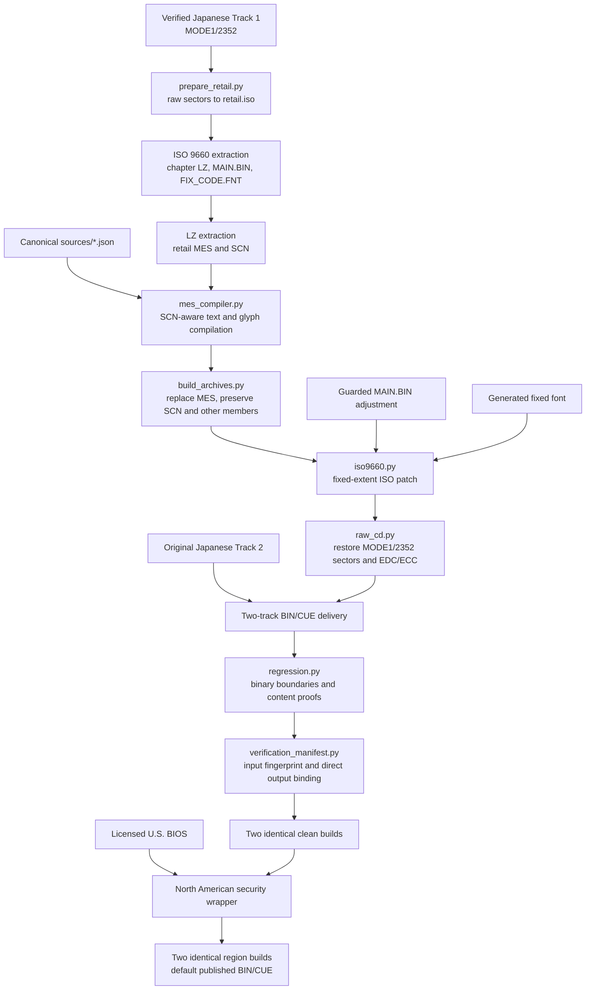

# Architecture

## Purpose and trust model

The project rebuilds an English Mega-CD disc from a verified original Japanese
disc plus tracked canonical translation data. It does not use an older
translated BIN as an input. That distinction is the central architectural
rule: retail data supplies structure and preserved bytes; tracked JSON supplies
reviewed English; code derives every output.

The North American artifact with Track 1 SHA-256
`1D99B456DA49F3F98B059B5E5DBAA6075DDE762C91448ABF20485B098E565C17` is the
runtime-reviewed reference for the current renderer contracts. It is not a
source input. Every future candidate starts from verified Japanese retail
tracks and tracked source; it must never restore an earlier translated image.
The reference completed a full maintainer Ares playtest with no reported
defects; independent regression playtests remain welcome and are required anew
for any candidate with changed playable bytes.

The current public source release is 1.0.2. It does not designate a different
runtime artifact; source metadata points to the same reference and its recorded
playtest evidence in [the release policy](RELEASE.md).

Three classes of data are intentionally separated:

| Class | Examples | Authority |
| --- | --- | --- |
| Retail input | Japanese Track 1, Track 2, extracted MES/SCN | Read-only structural and binary authority |
| Canonical source | `sources/*.json`, glossary, exemptions, layout rules | Human-reviewed translation and policy authority |
| Generated output | MES, LZ, ISO, BIN/CUE, reports, comparison package | Disposable products that must be reproducible |

## End-to-end flow



`rebuild.py` performs the clean flow twice in independent directories. The
default operator build then applies the guarded North American region wrapper
twice to the proven clean result. Publication occurs only if every explicitly
named binary artifact agrees across both runs of its stage and both clean runs
report the same aggregate input fingerprint. Each run writes a machine-readable
input/output binding before publication. `--region japan` is an explicit
archival/diagnostic override rather than the project default.

## Repository map

| Path | Role |
| --- | --- |
| `nostalgia1907.py` | Supported operator CLI and safety preflight |
| `nostalgia1907.project.json` | Version, hash, inventory, and path contract |
| `work/clean_rebuild/sources/` | Canonical per-chapter English records |
| `work/clean_rebuild/` | Production formats, compiler, builders, audits, and tests |
| `work/region_variant/` | Guarded North American BIOS-region wrapper |
| `work/clean_rebuild/retired_workspace_register.json` | Portable record of retired pre-clean-rebuild workspaces and their replacements |
| `tests/` | Source-only CLI, policy, and documentation tests |
| `outputs/` | Ignored generated reports, comparisons, and playable products |

## Supported entry point

Contributors should call the unified CLI instead of invoking build stages
manually:

```text
doctor -> prepare -> edit/compare -> validate -> build
```

The lower-level scripts remain importable because they are useful for format
analysis and focused testing. Each production module enforces the invariants it
owns; for example, direct MES compilation now rejects semantic token splits as
well as byte-level row errors. Direct invocation can still omit repository,
cross-chapter, comparison, deterministic-build, and runtime gates. Use it only
when investigating a specific stage, and never treat one lower-level success as
release proof.

## Production module ownership

`rebuild.py` contains `PRODUCTION_MODULES`, the executable production boundary.
Before a build, a bounded static audit verifies that all local imports stay in
that allowlist, canonical source paths remain direct children of `sources/`,
tracked production data exists, and production code contains no known
historical-workspace marker. The final report describes that exact scope rather
than claiming a universal absence of every possible legacy dependency. Retail
inputs and generated artifacts remain independently protected by hashes and
cross-layer regression. The modules have deliberately narrow responsibilities:

| Module | Owns | Must not own |
| --- | --- | --- |
| `raw_cd.py` | MODE1/2352 headers, user data, EDC/ECC, CUE | Translation or ISO file placement |
| `iso9660.py` | Directory records, extents, logical sizes | Archive/member interpretation |
| `lz_format.py` | Archive table and backward LZ codec | MES semantics |
| `mes_format.py` | MES parsing and structural validation | English layout decisions |
| `source_json.py` | Strict UTF-8 JSON loading with duplicate-key rejection | Canonical policy or renderer inference |
| `font_render.py` | 12x12 glyph bitmap generation | Record ordering or SCN roles |
| `scn_layout.py` | Renderer role, width, stride, row inference | Translation wording |
| `renderer_format.py` | Shared semantic normalization, wrapping, row reconstruction, and token-boundary validation | MES encoding or SCN inference |
| `profile_schema.py` | Active profile schema, legacy-field classification, and canonical text locks | Renderer geometry implementation |
| `mes_compiler.py` | Canonical records to MES bytes, including compiler-local semantic-row enforcement | ISO/raw-disc mutation |
| `prepare_retail.py` | Exact retail verification and extraction | Reuse of translated artifacts |
| `build_mes_set.py` | Compile all chapters and assemble font | Archive placement |
| `build_archives.py` | Install MES members within guarded archive capacity | SCN modification |
| `main_patch.py` | One frozen, hash-guarded executable UI adjustment | General patching |
| `regression.py` | Cross-layer invariant proofs | Product generation |
| `verification_manifest.py` | Stable input fingerprints, explicit artifact snapshots, report binding | Disc generation or file discovery by glob |
| `rebuild.py` | Orchestration, determinism proof, publication | Format-specific logic |

Analysis and review modules such as `translation_formatter.py`,
`translation_audit.py`, `translation_validation.py`,
`export_bilingual_comparison.py`, `export_fixed_layout_review.py`, and
`export_translation_proposals.py` run before the binary build. They do not
become inputs by copying generated game bytes; they validate or report on the
tracked source. The comparison exporter uses a fresh run-specific staging tree,
an explicit expected-file manifest, a metadata-free one-bit PNG encoder, and a
fully specified stored-entry ZIP writer. It never packages files by directory
glob.

## Cryptographic verification binding

A build report is not accepted merely because it contains hashes.
`verification_manifest.py` fingerprints the exact canonical chapter files,
prepared Japanese MES/SCN/archive fixtures, production and verification Python,
layout rules, glossary/repair/exemption configuration, project configuration,
original Track 1 and Track 2, normalized build profile and command, and runtime
identity. Absolute workspace paths and undeclared scratch files are excluded.

The aggregate input fingerprint is computed over one canonical manifest that
contains the complete declared input and runtime inventory. Every expected MES,
LZ, font, executable, ISO, report, Track 1, Track 2, and CUE artifact is then
named explicitly and hashed. The report writer rehashes
those paths immediately before writing the machine and human reports and rejects
a missing, replaced, or stale artifact. Product directories are also checked
for unexpected files before report creation.

This binds a report to the bytes it actually describes. It does not prove that
static previews render correctly at runtime; playtesting remains a separate
release gate.

## Comparison determinism contract

The comparison ZIP is byte-identical across machines and operating systems when
all retail/canonical input bytes, exporter source, and the CPython major/minor
runtime are identical. The exporter fixes UTF-8/LF text, normalized POSIX member
paths, lexicographic ordering, metadata-free one-bit PNG bytes, stored DEFLATE
blocks, ZIP timestamps, permissions, flags, compression method, extras, and
comments. No Pillow or platform ZIP encoder participates.

Every invocation uses a fresh, run-specific staging directory and an expected
member manifest derived from that invocation. Missing or unexpected staging
files abort publication; the ZIP contains only manifest-listed members. The
external package manifest records the final archive SHA-256 and every member's
path, size, and SHA-256. Different CPython major/minor versions and later
third-party archive/image rewrites remain outside the guarantee.

## Canonical source ownership

`sources/index.json` fixes chapter order and per-chapter counts. Each chapter
file contains:

- retail MES and SCN size/hash guards;
- an embedded renderer profile for reviewed exceptions;
- a contiguous zero-based record table;
- one policy per record;
- canonical English for translated records;
- explicit adaptive or fixed layout ownership.

SCN operands use one-based MES IDs. Source JSON and stable IDs use zero-based
indexes. Thus SCN text ID `4` refers to source record `003`.

The compiler never discovers a record by matching English. IDs and order remain
authoritative even if the wording changes completely.

`profile_schema.py` makes the embedded profile executable. Live fields are
validated and consumed by renderer inference or canonical text validation.
Known migration-era fields are accepted only as legacy provenance and have no
production effect. An unknown field is an error rather than a silently ignored
setting. `text_sources` contains portable historical-provenance labels only; it
is not a path dependency or a build input.

## Renderer ownership

The game has several text renderers, not one universal box. `scn_layout.py`
classifies records from original SCN command structure:

- lower-window dialogue and its speaker label;
- dialogue continuation rows;
- floating thought and overlay windows;
- location and perspective labels;
- menu choices;
- reviewed narration exceptions.

`translation_formatter.py` and `mes_compiler.py` use the same inferred
`RecordContract` and the same public `renderer_format.py` functions. A preview
and direct compilation therefore share semantic normalization, wrapping,
visible-cell measurement, row reconstruction, and whole-token enforcement.
The compiler repeats the authoritative semantic-row check before encoding, so
the lower-level API cannot rely on a formatter having run first.

Adaptive records store semantic text without manual wrapping. Fixed records
retain reviewer-controlled spacing because no safe general reflow geometry has
been proven for their renderer.

## Binary boundary strategy

The project avoids relocating disc structures:

1. MES record count and order never change.
2. A rebuilt MES must fit pointer and runtime glyph limits.
3. A chapter LZ is replaced in its original member slot when possible.
4. If a member slot is too small, archive members may reflow only inside the
   archive's existing ISO allocation.
5. ISO files retain their original extents; only logical sizes and allocated
   payload bytes change.
6. Raw Track 1 retains its sector count and non-user-data geometry.
7. Track 2 is copied exactly.

`regression.py` proves that ISO bytes outside declared file allocations and
directory-size fields remain unchanged.

## Historical workspaces

Historical scripts explain how formats and edge cases were discovered. They are
not imported by `rebuild.py`, and their outputs are not permitted as clean-build
inputs. `PRODUCTION_MODULES` is the exact binary-build allowlist. Maintained
review tools are the modules called by `nostalgia1907.py validate` and the files
covered by `tools/style_audit.py`; other one-off scripts in
`work/clean_rebuild/` are forensic notes unless this document and a test promote
them explicitly. Use forensic scripts as research notes only.

`export_font_patterns.py` and `forensic_decode_mes.py` are retained provenance
utilities, not supported build commands. They have no contributor-machine
defaults and run only when their historical renderer and extracted-data paths
are supplied explicitly. Their outputs remain forbidden as clean-build inputs.

When promoting a discovery:

1. restate it as a general format or renderer rule;
2. implement it in a production or validation module;
3. add a focused regression test;
4. verify it across every affected chapter;
5. keep the historical script outside the production dependency graph.

## Where to make a change

| Goal | Primary location |
| --- | --- |
| Correct English wording | `sources/<CHAPTER>.json` through `nostalgia1907.py edit` |
| Correct a repeated name/term | canonical records plus `translation_glossary.json` when it must stay locked |
| Fix wrapping for a known renderer class | `scn_layout.py` or shared compiler formatting |
| Add a semantic invariant | `translation_validation.py` and its data tables |
| Analyze MES structure | `mes_format.py` |
| Analyze archive compression/capacity | `lz_format.py` |
| Analyze ISO placement | `iso9660.py` |
| Analyze sector checksums | `raw_cd.py` |
| Change production orchestration | `rebuild.py`, with determinism tests |

If the proposed solution starts with a chapter name or screenshot coordinate,
pause and determine whether the actual rule belongs to canonical wording,
renderer classification, or a binary format. Production code should express
the general rule.
